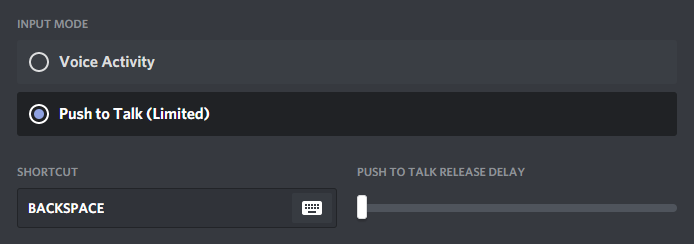
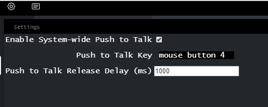
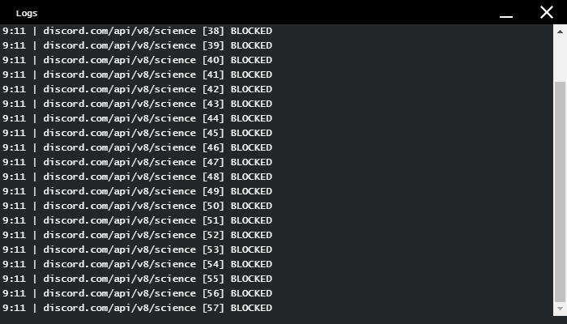

# Discord-Sandbox 

> Open-source Sandbox Discord client for the privacy-minded. Say NO to intrusive data collection.

Are you worried Discord is watching what programs you have open or listening to your mic even while you're not pressing your push-to-talk key?
Discord-Sandbox isolates the Discord client from reading background processes by running the [Discord web client](https://discord.com/) inside of a [\<webview>](https://developer.chrome.com/apps/tags/webview), which is finally contained inside the Electron process. While I cannot guarantee this client protects you from anything, I have tried my best to remove Discord's data collection.

Note that since this client is running the Discord web client, the following features will NOT be available.

    - Streaming your desktop
    - Discord's "High Quality Audio" or whatever

## Push to Talk
1. To enable push-to-talk, open Discord-Sandbox, set your push-to-talk key to `Backspace`, and lower the `Push to Talk Release Delay` slider all the way to 0 as shown.

2. Click on the gear icon in the top left corner. Check the box to enable system-wide push to talk. Set your push to talk key by clicking in the black box and pressing the desired key (Default PTT key is mouse button 4). Configuration settings are stored in `/Documents/DiscordSandbox/config.json`.

## Telemetry Mitigations
As detailed from [Luna Mendes' discord-unofficial-docs]("https://luna.gitlab.io/discord-unofficial-docs/"), Discord sends telemetry data over the `/api/science` endpoint. This project does its best to disable this telemetry communication by running javascript code into the webview that adds a blacklist/whitelist to the default `XMLHttpRequest` behavior. In this way, we explicitly block all communication with the `science` address, while simultaneously whitelisting addresses needed for minimum Discord functionality. See the full code in [mainRender.js]("./views/js/mainRender.js"). 

Discord likely does other sneaky things to spy on us. If you have any ideas on improving this project's security/privacy please let me know by opening an issue!

Clicking on the Logs icon to the right of the settings button in the client will open the Log window, which will detail when a communication by the client is blocked.

## What this Client Tries to Do
Discord-Sandbox tries to isolate the Discord client within the Electron process, preventing it from watching keystrokes or processes it has no business in.

## What this Client Cannot Do
Discord's desktop application has the capabilities to collect a lot of user-behavior information.
This project seeks to isolate your keystrokes and background processes from Discord.
Discord can still collect the following information. Since these are inherent to the service, we can't do much about it.

- Messages, client data, emails, and voice data
- Links you have clicked/opened from within the client (Passing links to a browser has been disabled to somewhat mitigate this)

### How does Push-to-Talk Work?
The [Discord web client](https://discord.com/) lacks push-to-talk detection while the browser session does not have window focus. This project works enables system-wide push-to-talk while respecting your privacyby using a separate key-press detection library, [iohook](https://www.npmjs.com/package/iohook), and mediating its interaction with Discord.
This separates your activity from Discord without compromising usability.

When your push-to-talk key is held down, the renderer process will send a `backspace` key-down keycode to the [\<webview>](https://developer.chrome.com/apps/tags/webview). This opens your microphone without giving the client window focus, so you can use Discord without worrying about the client listening in on whatever else you're running.

## Building From Source
0. If you're using Windows 10, make sure you have the [latest C++ Redistributable for Visual Studio 2015, 2017, and 2019](https://support.microsoft.com/en-us/help/2977003/the-latest-supported-visual-c-downloads)
1. Install [Node (https://nodejs.org/en/download/)](https://nodejs.org/en/download/)
2. Clone Repo `git clone https://github.com/khlam/discord-sandboxed.git`
3. Install dependencies `npm i && npm i -d`
4. Run `npm start`
5. (Optional) Create Windows installer `npm run package-win`

> This Discord-Sandbox open source project is not affiliated with Discord or Discord Inc.
I do not claim to have created Discord.
Discord-Sandbox is not the official Discord client.
Discord is a freeware VoIP application made by Discord Inc.
You can download the official Discord client [Here](https://discord.com/).
